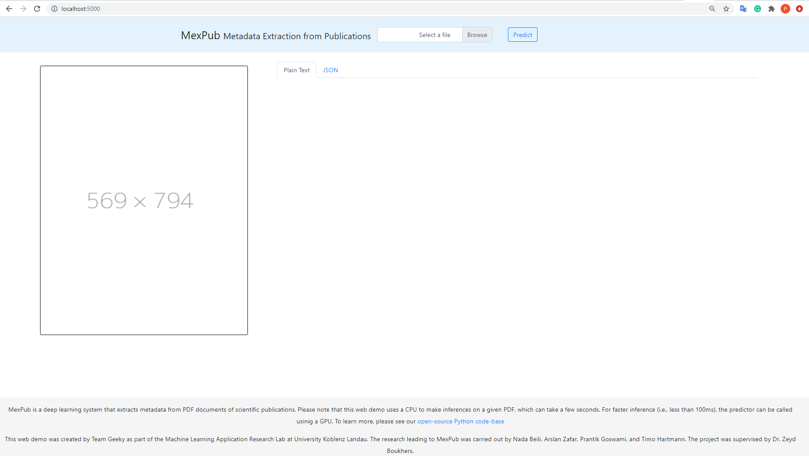
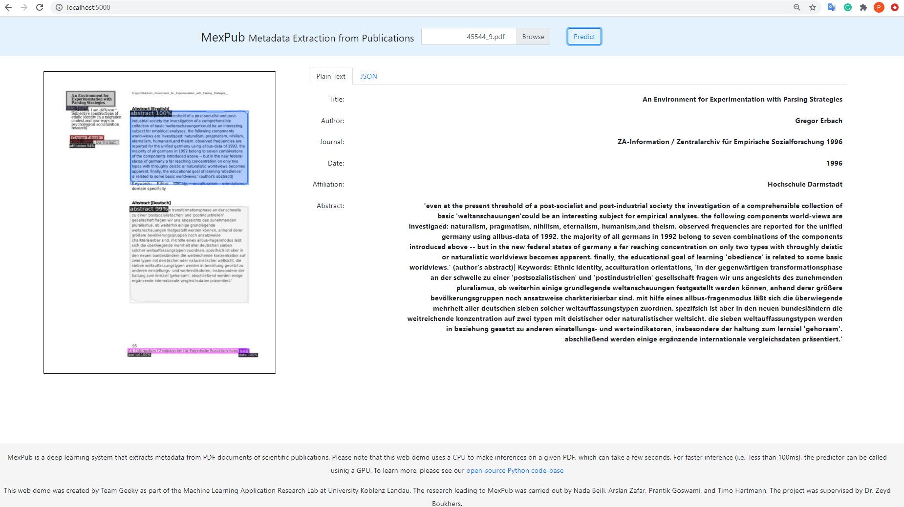
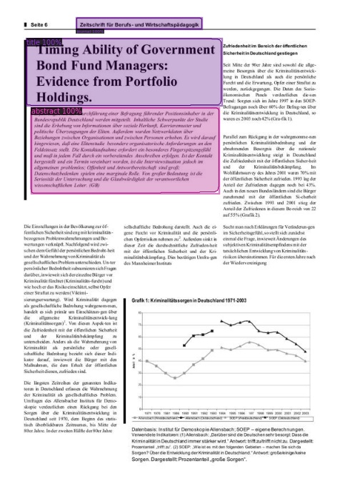
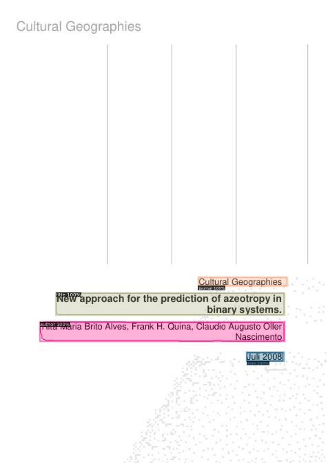
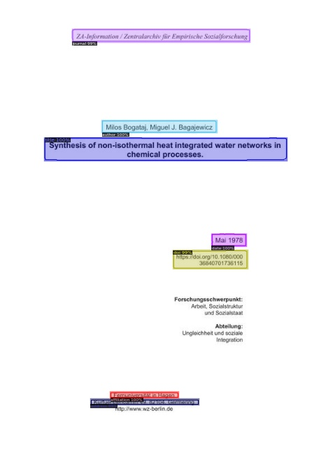
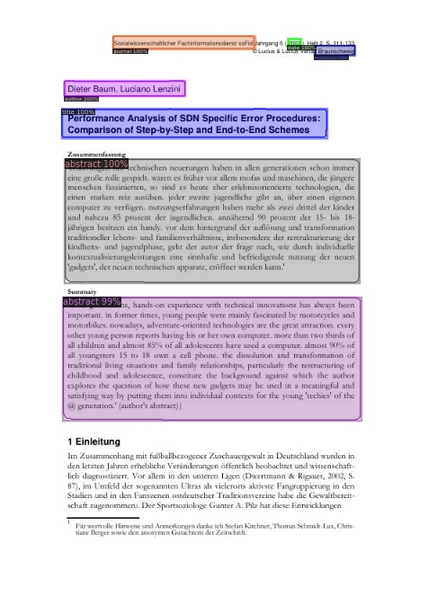
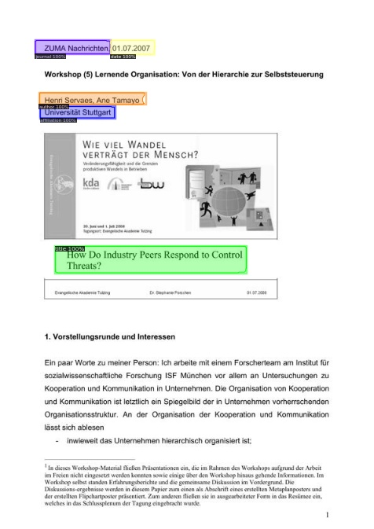

# Metadata extraction from German scientific papers 

This repository contains  a method of extraction metadata from  German scientific papers (PDF) using  [Detectron2](https://github.com/facebookresearch/detectron2) implementation and synthetic data of German publications.   

In this project we used an implementation of detectron2 that was trained with 200K images from PublayNet dataset ([model](https://github.com/hpanwar08/detectron2))and we re-finetuned it with 30k of our synthetic data.  

Our model extracts nine metadata classes:Title, Author, Journal, Abstract, Affiliation, Email, Address, DOI, Date.

## Quick Links

- [Data](#data)
- [Training and Evaluation](#training-and-evaluation)
- [Installation](#installation)
- [Getting Started](#getting-started)
- [Sample Results](#sample-results-of-our-model)
- [License](#license)
## Data
The Data contains around 44K papers with German and English content. 100 of  German scientific papers  randomly selected from available publications in [SSOAR](https://www.gesis.org/ssoar/home) with various layout and style. we extended our dataset by automatically generating synthetic papers based on the 28 most common layouts we identified during the mannual annotation phase. To this end, we randomly extracted metadata records from [SSOAR](https://www.gesis.org/ssoar/home) , [DBLP](https://dblp.org/xml/release/) ,  and a list of scientific affiliations from [Wikipedia](https://de.wikipedia.org/wiki/Liste).
For each of these layouts, we generated an average of 1600 synthetic papers by randomly inserting metadata from the extracted metadata at their corresponding positions on the first page.

## Training and Evaluation
### Training configuartion:
* we froze the stem and the first backbone layer:  `cfg.MODEL.BACKBONE.FREEZE_AT= 2`
*  learning rate of 0.0025
* Number of iterations: 15000
* 70% training, 15% validation, and 15% test data.
### Final model and config files
| Architecture                                                                                                                                       | Config file                                                 | Training Script            |
|---------------------------------------------------------------------------------------------------------------|-----------------------------------------------|--------------------------|
| [MaskRCNN Resnext101_32x8d FPN 3X](https://drive.google.com/file/d/1Ie1SeTKoqzPH86DN2xPBgEz-3qq6DLoE/view?usp=sharing) | configs/DLA_mask_rcnn_X_101_32x8d_FPN_3x.yaml | ./model_training/Final/detectron2_training_fullData.ipynb |

### Evaluation
 Dataset                                              |  AP     | AP50   | AP75   | AP Small | AP Medium | AP Large | 
|------------------------------------------|--------|---------|---------|------------|---------------|------------|
| Validation set | 90.363 | 95.828 | 95.269 | 74.173 | 81.523 | 95.273|
|Test set            |90.167 | 95.626 | 94.911 | 75.199 | 81.275 | 79.225|


 ## Installation

1. Run ```git@github.com:nbeili/Metadata-extraction-from-German-scientific-papers.git``` to clone this repository.
2. [Download the model](https://drive.google.com/file/d/1Ie1SeTKoqzPH86DN2xPBgEz-3qq6DLoE/view?usp=sharing) and copy it to the [models/](models) folder
3. There are two ways to install the model locally: using Docker or by manually installing the dependencies

### Docker Deployment
```
cd pubmexwebdemo

# run docker build to create the docker image using and specify the name of the image.
# For instance, run
docker build -t my-mexpub-app .

# run the docker image inside a container and specify a port. This will allow you to both use the model locally
# and run the web application on localhost
docker run -it -p 5000:5000 --name mexPubContainer my-mexpub-app:latest

# the web application can now be accessed from a browser using hhtp://localhost:5000

```
Note: by default, the web application makes inferences using the CPU. To run the model on a GPU for faster inference, set the use_cuda parameter to True inside [main.py](pubmexwebapp/main.py).

 |  |  |
 |---------------------------------------------------------------------------|---------------------------------------------------------------------------|

 ### Manual installation
 ##### Requirements:
 - Linux or macOS
 - Python ≥ 3.6
 - pip >= 20.2.3

```

# install the necessary dependencies
pip install -r requirements.txt detectron2==0.1.3 -f https://dl.fbaipublicfiles.com/detectron2/wheels/cu101/torch1.5/index.html
```

## Getting Started

### Run a simple demo of the model
Run below command for prediction on a single PDF document. The demo will store two files at the specified output path: (i) an image of the PDF's first page including bounding boxes for the predictions, (2) a .json file containing the inferred metadata.
```
python demo/demo.py <path/to/input.pdf> <output/path/> --model-dump <path/to/model.pth> --config-file <path/to/config-file.yaml> --use_cuda <True/False>

# for help run
python demo/demo.py -h
```

## Sample results of our Model
|  |  |
|---------------------------------------------------------------------------|---------------------------------------------------------------------------|
|  |  |
|  |  |


## License
[MIT](https://choosealicense.com/licenses/mit/)

